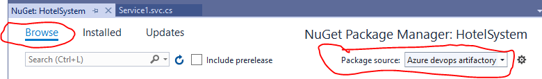

# Assignment3LargeSystem
[](https://dev.azure.com/cph-gm/HotelSystem/_packaging?_a=package&feed=00f28315-07cd-4904-bb81-bcbe1fda6296&package=3fc18ddb-6b4c-415e-a6ad-a362e360e07f&preferRelease=true) [](https://dev.azure.com/cph-gm/HotelSystem/_build/latest?definitionId=4&branchName=master)

## Links

  [Azure devops project](https://dev.azure.com/cph-gm/HotelSystem)

## Guides

### Updating this project

Most important thing is, to update the _package version_, otherwise it will not be considered new version in the artifactory. You can do this by incrementing `<version>` attribute in the [HotelInterface.nuspec](HotelInterface.nuspec) file. Normally Nuget packages use [Semantic versioning](https://semver.org/), but since this is a uni project, feel free to ignore that part.

### Adding as a NuGet dependency(for other projects)

#### Easy way

The easiest way is to follow [this](https://docs.microsoft.com/en-us/azure/devops/artifacts/nuget/consume?view=azure-devops) guide. The problem with it is that then it will only be added for **you**. If you were to create a new project like this and then push it to Github, everyone using it would have to follow the same guide. There is an alternative.

#### The better way

Create a file called `NuGet.Config` in the projects folder. The file should contain  the following code, the value(it says **CHANGE ME** now) must be changed to the **package source url** found on Azure devops artifacts section under the feed callled **Inteface feed**.
```
<?xml version="1.0" encoding="utf-8"?>
<configuration>
  <packageSources>
    <add key="Azure devops artifactory" value="CHANGE ME" protocolVersion="3" />
  </packageSources>
</configuration>
```

After creating this file, close the solution and re-open it(if you had it open). After this you should be able to open the project and selected **Manage NuGet packages...** as you normall would. Make sure you select the correct **Package source** in the NuGet interface, see picture below.


## SSDs:
![alt text][logo]

[logo]: https://github.com/large-systems/Assignment3LargeSystem/blob/master/SSD_MakeBooking.jpg "SDDs we have created based on our use cases"

### Cancel booking


### Get booking details


### Add new hotel


Usecase diagram:


Logic model:

