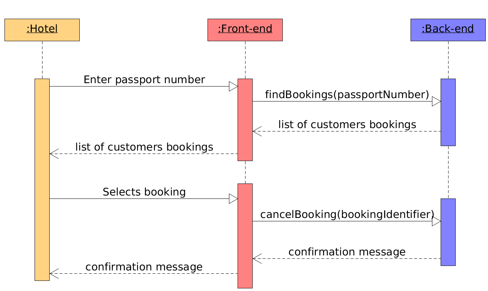
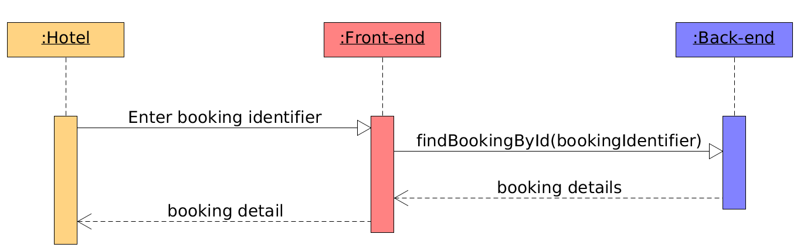
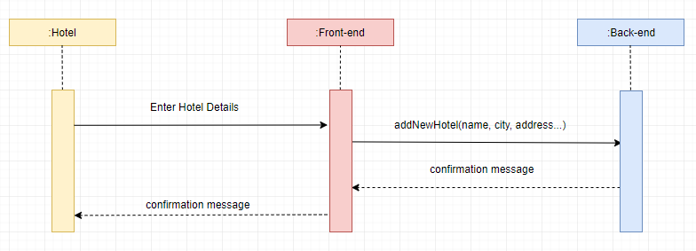

# Assignment3LargeSystem 

## Links

  [Azure devops project](https://dev.azure.com/cph-gm/HotelSystem)

## SSDs: 
![alt text][logo]

[logo]: https://github.com/large-systems/Assignment3LargeSystem/blob/master/SSD_MakeBooking.jpg "SDDs we have created based on our use cases"

### Cancel booking

### Get booking details

### Add new hotel

Usecase diagram: 

Logic model: 

